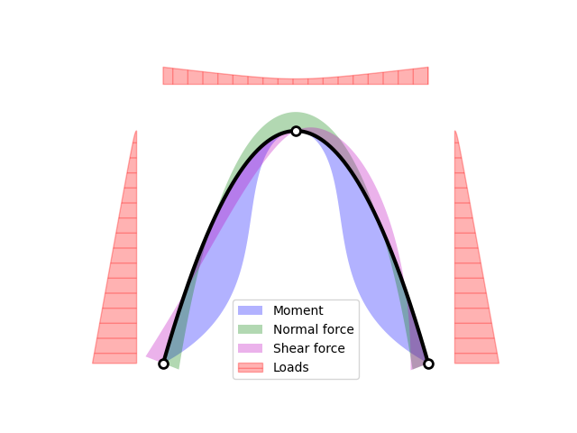
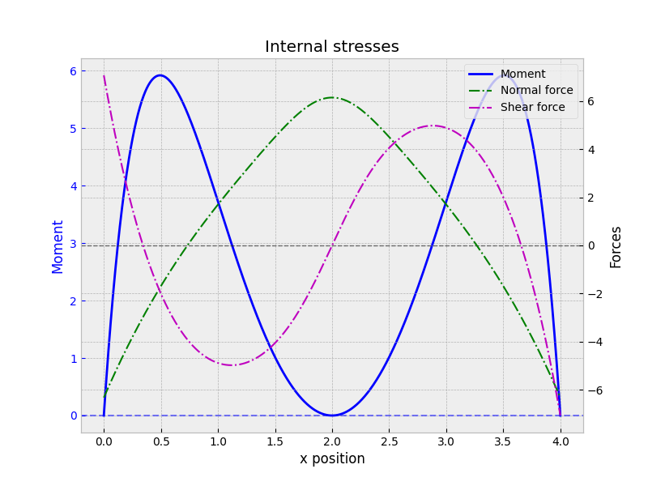

# ThreeHingeArch
Describing the first order reaction of a three-hinged arch to a load

By first defining loads to apply along the archs

This package allows to compute the NVM diagram

And thus extract the internal stresses

